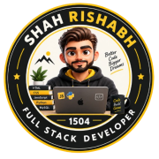

<table width="100%">
<tr>
<td width="15%" align="center">

</td>
<td width="70%" align="center">

</td>
<td width="15%" align="center">

</td>
</tr>
</table>

<h3>Web Developer &nbsp;·&nbsp; B.Sc. IT (Honours) &nbsp;·&nbsp; AR/VR Enthusiast</h3>

 

  

<table align="center">
<tr>
<td align="center" width="25%">YEARS LEARNING <b>3+</b></td>
<td align="center" width="25%">PROJECTS BUILT <b>15+</b></td>
<td align="center" width="25%">DEGREE <b>B.Sc. IT (Hons)</b></td>
<td align="center" width="25%">CURIOSITY <b>∞</b></td>
</tr>
</table>

## 🚀 About Me

I'm a passionate **4th Year B.Sc. IT (Honours)** student at **P. P. Savani University**, building responsive, high-performance web applications with clean UI/UX and scalable design. I love turning ideas into real digital products — and I'm currently diving deeper into **AR/VR** and **Image Processing** to push what's possible on the web.

<table>
<tr>
<td width="50%" valign="top">

**🔭 Right now**
- Working on: HyFun Foods – Corporate Website
- Learning: Lens Studio · Image Processing

</td>
<td width="50%" valign="top">

**🤝 Let's connect**
- Collaborate on: Student Attendance Management System
- Need help with: Caria

</td>
</tr>
</table>

📄 **Portfolio:** [rishabh-shah-portfolio.netlify.app](https://rishabh-shah-portfolio.netlify.app/) &nbsp;·&nbsp; 📫 **Email:** shahrishu1515@gmail.com

## 🛠️ Tech Stack

<table>
<tr>
<td width="18%"><b>Frontend</b></td>
<td></td>
</tr>
<tr>
<td><b>Backend & DB</b></td>
<td></td>
</tr>
<tr>
<td><b>Languages</b></td>
<td></td>
</tr>
<tr>
<td><b>Tools</b></td>
<td></td>
</tr>
</table>

## 📂 Featured Projects

| Project | What it is | Links |
|---|---|---|
| 🥔 **HyFun Foods** | Corporate website for a frozen-potato brand | [Live](https://shahrishabh1513-jsk.github.io/hyfun-foods-corporate-website/) · [Code](https://github.com/shahrishabh1513-jsk/hyfun-foods-corporate-website) |
| 🧾 **RT Invoice** | GST-ready billing & invoicing app | [Live](https://shahrishabh1513-jsk.github.io/RT-invoice-generator/) · [Code](https://github.com/shahrishabh1513-jsk/RT-invoice-generator) |
| 📄 **RT Resume Builder** | ATS-friendly resume builder with live preview | [Live](https://shahrishabh1513-jsk.github.io/RT-resume-builder/) · [Code](https://github.com/shahrishabh1513-jsk/RT-resume-builder) |
| 💻 **RT_SyntaxLab** | 9-language programming tutorial hub | [Live](https://shahrishabh1513-jsk.github.io/RT_Syntaxlab/) · [Code](https://github.com/shahrishabh1513-jsk/RT_Syntaxlab) |
| 🛍️ **HR Atelier** | Fashion store with a Gemini AI assistant | [Live](https://shahrishabh1513-jsk.github.io/HR-Atelier/) · [Code](https://github.com/shahrishabh1513-jsk/HR-Atelier) |
| 👗 **RT_Fashion World** | Pastel-season fashion e-commerce site | [Live](https://shahrishabh1513-jsk.github.io/RT_Fashion-World/) · [Code](https://github.com/shahrishabh1513-jsk/RT_Fashion-World) |
| 🏰 **RT RoyalBNB** | Heritage stays booking platform | [Live](https://shahrishabh1513-jsk.github.io/RT-RoyalBNB/) · [Code](https://github.com/shahrishabh1513-jsk/RT-RoyalBNB) |
| 🏡 **Krishna Harmony** | GSAP-animated villa landing page | [Live](https://shahrishabh1513-jsk.github.io/krishna-harmony-gsap-animated-website/) · [Code](https://github.com/shahrishabh1513-jsk/krishna-harmony-gsap-animated-website) |
| 🚗 **Used Car Price Prediction** | Machine-learning regression project | [Code](https://github.com/shahrishabh1513-jsk/Indian-Used-Car-Price-Prediction) |

## 📊 GitHub Stats

<table align="center">
<tr>
<td valign="top" width="50%">

</td>
<td valign="top" width="50%">

</td>
</tr>
</table>

## 📈 Live Activity Graph

✨ "Code is like humor — when you have to explain it, it's bad." ✨

